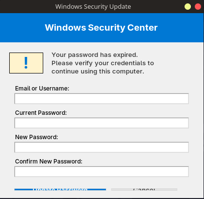
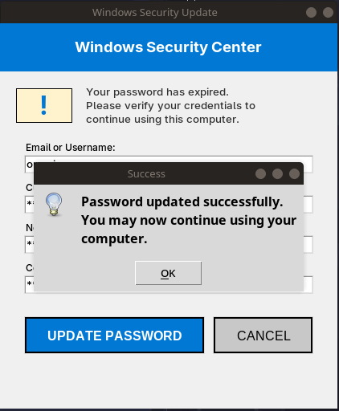
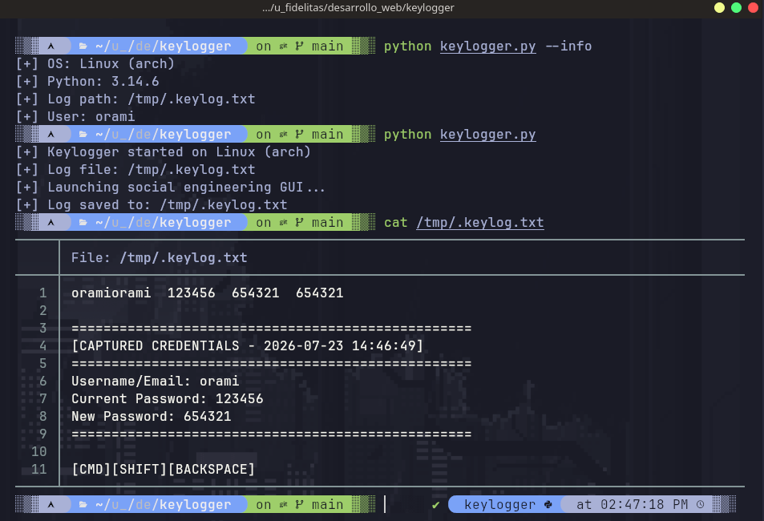

# Educational Keylogger

Cross-platform keylogger with social engineering GUI simulation for **cybersecurity education**.

> **DISCLAIMER:** This tool is for EDUCATIONAL and AUTHORIZED TESTING purposes only.
> Unauthorized use of keyloggers is illegal and unethical. The author is not responsible
> for any misuse of this software. Only use it on systems you own or have explicit
> authorization to test.

## What This Project Demonstrates

- How keyloggers capture keyboard input
- How social engineering attacks trick users into entering credentials
- OS detection and cross-platform development
- Thread-safe keyboard listener with pynput
- tkinter GUI development for security tool interfaces

## Features

- **OS Detection** - Automatically detects Linux (Debian/Arch), Windows, and macOS
- **Social Engineering GUI** - Fake "Password Update Required" dialog that captures credentials
- **Cross-platform** - Works on Linux, Windows, and macOS
- **Configurable output** - Custom log file path via `--output` flag
- **Terminal mode** - Run without GUI using `--no-gui` flag
- **Installation helper** - Auto-detects distro and shows correct install commands

## Requirements

- Python 3.7+
- `pynput` library

## Installation

```bash
# Clone the repository
git clone https://github.com/oramirez13/K_logger.git
cd keylogger

# Install dependencies
pip install -r requirements.txt
```

### Auto-detect your OS and show install commands

```bash
python keylogger.py --install
```

## Usage

### With GUI (Social Engineering Simulation)

```bash
python keylogger.py
```

This launches a fake "Windows Security Update" dialog that:

1. Asks the user for their email/username
2. Asks for their current password
3. Asks for a new password
4. Captures all keyboard input while the dialog is open
5. Saves everything to a log file

### Without GUI (Terminal Mode)

```bash
python keylogger.py --no-gui
```

Captures all keyboard input until you press `Ctrl+C`.

### Custom Output Path

```bash
python keylogger.py --output /path/to/log.txt
```

### System Information

```bash
# Show detected OS, Python version, and log path
python keylogger.py --info

# Show installation instructions for your OS
python keylogger.py --install
```

### Help

```bash
python keylogger.py --help
```

## Options

| Flag            | Description                                |
| --------------- | ------------------------------------------ |
| `--help`        | Show help message                          |
| `--info`        | Show system information                    |
| `--install`     | Show installation instructions for your OS |
| `--no-gui`      | Run without GUI (keyboard capture only)    |
| `--output PATH` | Specify custom log file path               |

## Log File Location

| OS      | Default Path            |
| ------- | ----------------------- |
| Linux   | `/tmp/.keylog.txt`      |
| Windows | `%APPDATA%\.keylog.txt` |
| macOS   | `~/.keylog.txt`         |

## Project Structure

```
keylogger/
├── keylogger.py        # Main script (unified, cross-platform)
├── requirements.txt    # Python dependencies
├── .gitignore          # Excludes log files and cache
├── LICENSE             # MIT License
└── README.md           # This file
```

## How It Works

1. **OS Detection** - The script reads `/etc/os-release` on Linux, `platform.system()` on all OS
2. **Keyboard Listener** - Uses `pynput.keyboard.Listener` to capture keystrokes in a background thread
3. **GUI Simulation** - tkinter dialog mimics a Windows password update prompt
4. **Credential Capture** - When the user submits the form, credentials are logged with a timestamp
5. **Log Output** - All captured data is written to the configured log file

## Screenshots

### Terminal Output



### Social Engineering Dialog



### Captured Log



## Ethical Use

This project is designed for:

- Learning how keyloggers work at a technical level
- Understanding social engineering attack vectors
- Practicing defensive security (detection, prevention)
- Authorized penetration testing with explicit written permission

**Do NOT use this tool for:**

- Unauthorized access to systems
- Stealing credentials without consent
- Any illegal activity

## License

MIT License - See [LICENSE](LICENSE) for details.
